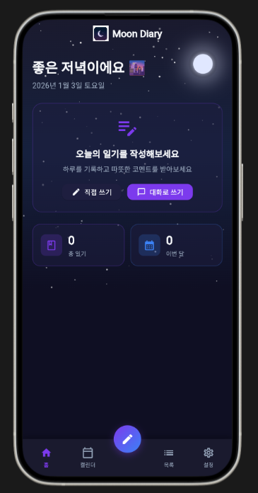

# 🌙 Moon Diary (문 다이어리)

> 밤하늘 감성의 일기장 앱 - AI와 대화하며 오늘 하루를 기록해요

<p align="center">
  
</p>

---

## ✨ 주요 기능

### 📝 일기 작성
- **직접 쓰기**: 오늘의 기분 이모지를 선택하고 자유롭게 일기를 작성
- **대화로 쓰기**: AI와 자연스러운 대화를 나누면 일기로 변환해줘요

### 💬 AI 대화 기능 (Gemini)
- AI가 "오늘 하루 어땠어?"라고 물어봐요
- 3~4번 대화 후 "일기로 정리해줄까?" 제안
- "응"이라고 답하면 자동으로 일기 변환!

### 💕 F감성 코멘트
- 작성한 일기에 따뜻한 공감 메시지 생성
- 기분과 내용을 분석해서 맞춤 코멘트 제공

### 📅 캘린더 뷰
- 월별로 일기를 한눈에 확인
- 각 날짜에 기분 이모지 표시

### 🌙 다크 모드
- 밤하늘 컨셉의 예쁜 다크 테마
- 눈이 편한 색상 조합

---

## 🎭 기분 이모지

| 이모지 | 기분 |
|:---:|:---:|
| 😊 | 행복해요 |
| 😢 | 슬퍼요 |
| 😠 | 화나요 |
| 🥰 | 사랑스러워요 |
| 😴 | 졸려요 |
| 😐 | 그저 그래요 |

---

## 🛠️ 기술 스택

| 구분 | 기술 |
|------|------|
| 프레임워크 | Flutter 3.35.4 |
| AI | Google Gemini API |
| 로컬 저장소 | Hive |
| 상태관리 | Provider |

---

## 🚀 설치 방법

### 1. 저장소 클론
```bash
git clone https://github.com/baesisi3648/pjt-moon_diary.git
cd pjt-moon_diary
```

### 2. 환경변수 설정
```bash
# .env.example을 .env로 복사
cp .env.example .env

# .env 파일 열어서 API 키 입력
GEMINI_API_KEY=여기에_본인의_API키_입력
```

### 3. Gemini API 키 발급 방법
1. [Google AI Studio](https://aistudio.google.com/app/apikey) 접속
2. Google 계정으로 로그인
3. "Create API Key" 클릭
4. 발급된 키를 `.env` 파일에 입력

### 4. 실행
```bash
# 패키지 설치
flutter pub get

# 앱 실행
flutter run
```

---

## 📁 프로젝트 구조

```
lib/
├── main.dart              # 앱 진입점
├── models/                # 데이터 모델
│   └── diary_entry.dart   # 일기 데이터 구조
├── screens/               # 화면 UI
│   ├── home_screen.dart   # 홈 화면
│   ├── write_diary_screen.dart    # 직접 쓰기
│   ├── chat_diary_screen.dart     # 대화로 쓰기
│   ├── calendar_screen.dart       # 캘린더
│   └── settings_screen.dart       # 설정
├── services/              # 서비스 로직
│   ├── gemini_service.dart    # Gemini AI 연동
│   ├── diary_service.dart     # 일기 저장/조회
│   └── comment_service.dart   # F감성 코멘트
├── providers/             # 상태관리
├── theme/                 # 테마 설정
└── widgets/               # 재사용 위젯
```

---

## ⚠️ 주의사항

- **`.env` 파일은 절대 GitHub에 올리지 마세요!** (API 키 노출 위험)
- 이미 `.gitignore`에 `.env`가 등록되어 있어요
- Gemini API 무료 할당량: 분당 60회, 일일 1,500회

---

## 📱 지원 플랫폼

- ✅ Android
- ✅ Web
- ⬜ iOS (별도 설정 필요)

---

## 📄 라이선스

이 프로젝트는 개인 학습 및 포트폴리오 목적으로 제작되었습니다.

---

<p align="center">
  <b>🌙 오늘 하루도 수고했어요. 편안한 밤 되세요! 🌙</b>
</p>
